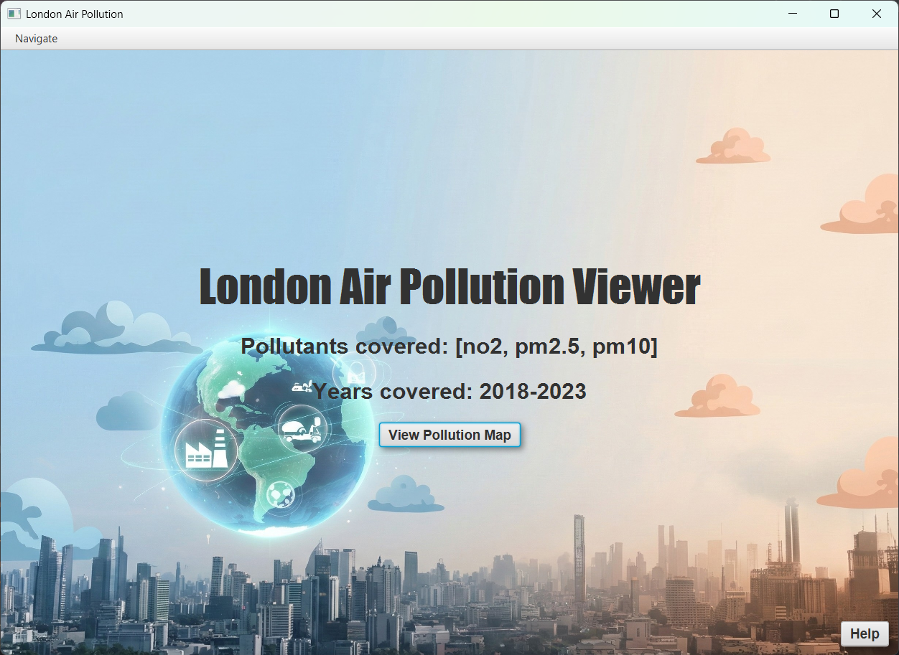
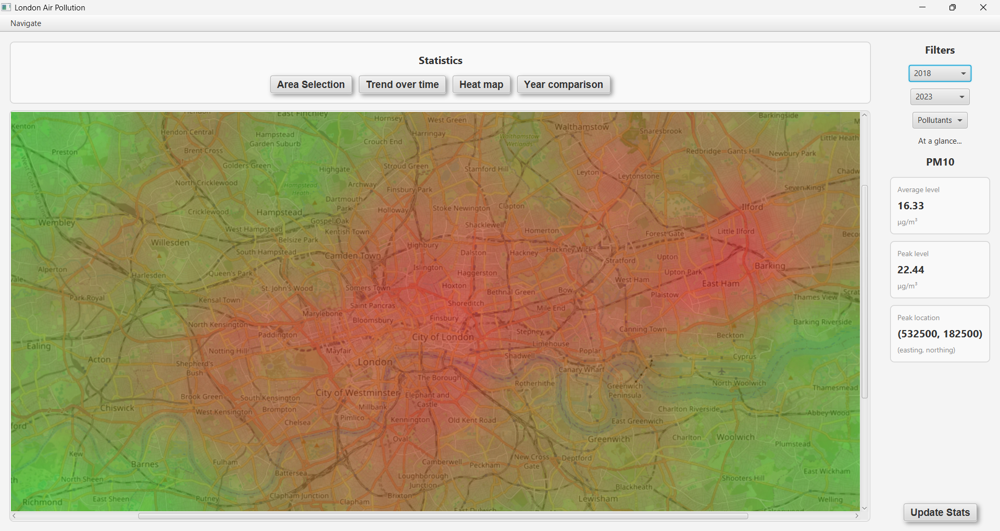
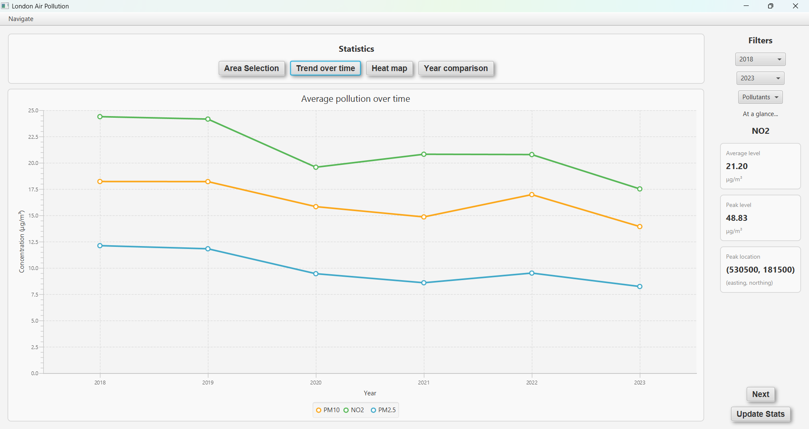

# London Air Pollution Visualiser

A JavaFX desktop app for exploring UK government (DEFRA) air pollution data for London: NO2, PM10 and PM2.5 annual means on a 1 km grid, 2018–2023. It shows pollution on an interactive map and computes statistics for any area you draw.

Team coursework (4 people).



## Features

- Interactive London map with colour-coded pollution, by pollutant and year.
- Grid-level detail: grid code, coordinates and value, by click or by grid-code search.
- **Statistics for a user-selected area** (my part):
  - average, peak and peak location for one or more pollutants over a year range;
  - trend line chart of the area average by year;
  - bar chart of the area peak by year;
  - heat map of peak values across the area.

## Run it

Requires JDK 23 or later. Maven is not required; the wrapper downloads it.

```bash
# Windows
mvnw.cmd javafx:run

# macOS / Linux
./mvnw javafx:run
```

Run the tests with `./mvnw test` (or `mvnw.cmd test`).

## My contribution



I designed and built the statistics panel:

| Class | What it does |
|---|---|
| `StatisticsPanel` | Coordinates the panel: validates the query, runs it and switches between the four windows. |
| `Query` and `Query.Builder` | Collects the user's inputs (years, pollutant, area corners) step by step and validates them before a query is built. |
| `QueryError` | Every reason a query can be rejected, with its user-facing message. |
| `StatisticsPanelCalculator` | Pure functions for average, peak, peak location and normalisation. Kept free of JavaFX so it can be unit tested. |
| `FiltersColumn` | Year and pollutant inputs, plus stat cards you can cycle through per pollutant. |
| `AreaSelectionWindow` | Click two corners on the map to define the area. Rejects boxes narrower than one grid square. |
| `TrendWindow`, `ComparisonWindow`, `HeatMapWindow` | Line chart, bar chart and heat map of the query results. |

The rest of the app was built by my teammates (E. N., T. A., P. P.).

## How a query works

1. The user picks years and pollutants and clicks two map corners. `Query.Builder` collects each input as it arrives.
2. `validate()` returns the first problem as a `QueryError`, or nothing if the query is valid.
3. `DataFilter.processQueryData` takes the datasets for that pollutant and year range, removes invalid points, and keeps only grid points inside the box. The corners can be clicked in either order.
4. `StatisticsPanelCalculator` reduces the result to the numbers shown on the cards and charts.

## Data



- **Source:** DEFRA Pollution Climate Mapping annual means (https://uk-air.defra.gov.uk/data/pcm-data).
- **Trimmed to London.** The national files are about 160 MB. The app only ever uses the London map area, so `scripts/trim_to_london.py` keeps the header and the roughly 1,000 grid squares inside the map bounds (0.6 MB in total). The app's behaviour is unchanged, but it clones and starts far faster. Re-run the script on the raw files to regenerate.

## Tests

34 JUnit 5 tests, covering:
- the statistics calculations, including empty and edge cases;
- query validation;
- area filtering against the real data (a 10 km × 10 km box holds about 100 grid squares, and corner order doesn't matter);
- dataset loading;
- the map coordinate conversions.

## Changes since submission

- **Fixed:**
  - The "peak pollution" bar chart was plotting area averages, not peaks.
  - Selecting an area with no data crashed the stat cards.
  - The heat map divided by zero when every value was equal.
  - The stat cards could go out of sync if pollutant checkboxes changed after a query.
- **Refactored:** numeric error codes (1–5) replaced with a `QueryError` enum.
- **Added:**
  - Maven build (previously run from an IDE).
  - Data trimming script.
  - 26 new tests.
  - GitHub Actions CI.

## Known limitations

- The heat map takes the maximum across every selected pollutant and colours them on one scale. NO2 values are much higher than PM2.5 values, so when both are selected NO2 dominates the colours. Selecting one pollutant at a time gives a fair picture.
- Values are modelled annual means on a 1 km grid, not readings from individual monitoring stations.

## Roadmap

- Live air quality: compare current readings from a public air-quality API with the 2018–2023 annual means for the same area (in progress).

## Tech

Java 23, JavaFX 25, JUnit 5, Maven, GitHub Actions.

## Credits

Data loading starter code (`DataLoader`, `DataSet`, `DataPoint`) by Michael Kölling, King's College London. Pollution data © Crown copyright, DEFRA, used under the Open Government Licence.
